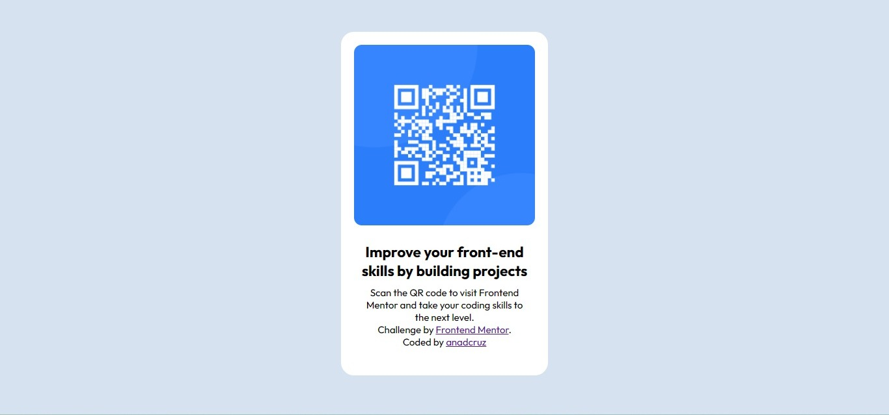

# Frontend Mentor - QR code component solution

Esta é uma solução para o [QR code component challenge on Frontend Mentor](https://www.frontendmentor.io/challenges/qr-code-component-iux_sIO_H). Frontend Mentor challenges ajudam você a melhorar suas habilidades de codificação criando projetos realistas.

## índice

- [Overview](#overview)
  - [Screenshot](#screenshot)
- [My process](#my-process)
  - [Built with](#built-with)
  - [What I learned](#what-i-learned)
- [Author](#author)

## Overview

### Screenshot

## Meu processo

### Construido com 

- HTML5 
- CSS 
- Flexbox

### O que aprendi 

Para mim foi desafiador/construtivo  escolher as propriedades corretas em css para que o body e o .card funcionassem e fossem vistos como o guia de estilo declarado. Acredito que esses conhecimentos adquiridos serão úteis em projetos futuros.

## Autor 

- GitHub - [anadcruz](https://github.com/anadcruz)
- Frontend Mentor - [@anadcruz](https://www.frontendmentor.io/profile/anadcruz)

